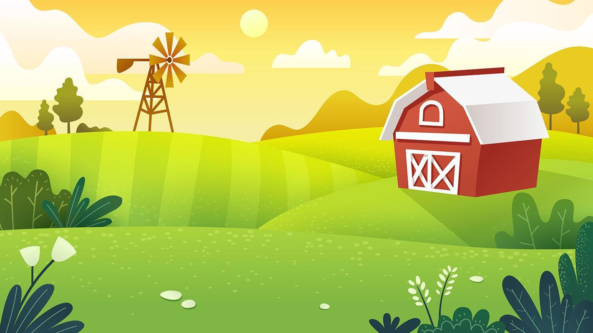

# Chicken Farm ([play here](https://abdullahamdi.com/chicken/))

Welcome to **Chicken Farm**, an exciting and interactive browser-based game where your quick reflexes and timing are put to the test! Use your hammer to whack as many chickens as possible before they overrun the farm.

 <!-- The farm background image used as a placeholder screenshot -->

## Table of Contents

- [Features](#features)
- [Getting Started](#getting-started)
- [How to Play](#how-to-play)
- [Controls](#controls)
- [Scoring and Multipliers](#scoring-and-multipliers)
- [Game Over Conditions](#game-over-conditions)
- [Installation](#installation)
- [Assets](#assets)
- [Credits](#credits)
- [License](#license)

## Features

- **Interactive Gameplay**: Hit the moving chickens with your hammer to score points.
- **Progressive Difficulty**: Chickens spawn more frequently and move faster over time.
- **Combos and Multipliers**: Increase your score by achieving combo multipliers.
- **Visual Effects**:
  - Chickens flip direction based on movement.
  - Multiplier text appears over dead chickens when achieving combos.
- **Audio Effects**: Background music and sound effects enhance the gaming experience.
- **Responsive Design**: Supports both desktop and mobile devices with mouse and touch controls.
- **Restart Functionality**: Easily restart the game after a game over.

## Getting Started

To get a local copy up and running, follow these simple steps.

### Prerequisites

- A modern web browser (Chrome, Firefox, Safari, Edge, etc.).

### Installation

1. **Clone the Repository**

```bash
   git clone https://github.com/yourusername/chicken-farm.git
```

1. **Navigate to the Project Directory**

```bash
Copy code
cd chicken-farm
Place Required Assets
```
## Ensure the following files are present in the project directory:

### Images:
- `chicken.png`
- `chicken-dead.png`
- `hammer-off.png`
- `hammer-on.png`
- `farm-background.jpg`

### Audio:
- `hit-sound.mp3`
- `miss-sound.mp3`
- `background.mp3`

*Note*: You can use your own assets or download free assets from reputable sources.

## Open the Game

Open `index.html` in your preferred web browser.

## How to Play

### Objective:
Hit as many chickens as possible with your hammer before they overrun the farm.

- Chickens will spawn and move around the screen. Use your hammer to hit them and prevent them from accumulating.

## Controls

### Desktop:
- **Mouse Movement**: Move the hammer.
- **Left Mouse Button (Click)**: Swing the hammer down.

### Mobile/Touch Devices:
- **Touch and Drag**: Move the hammer.
- **Tap**: Swing the hammer down.

## Scoring and Multipliers

### Scoring:
- Each chicken hit increases your score.
- The base score per chicken is multiplied by your current multiplier.

### Multipliers:
- Starting at 1x, the multiplier increases by 1 each time you hit a chicken within 2 seconds of the previous hit.
- The multiplier resets to 1 if you miss or wait longer than 2 seconds between hits.
- When the multiplier is 2x or more, it briefly appears over the dead chicken in blue text, fading away as the chicken disappears.

## Game Over Conditions

- The game ends when the number of live chickens on the screen reaches 20.
- A **Game Over** message and your final score will be displayed in blue text.
- Click the **Restart Game** button to play again.

## Assets

All assets should be placed in the same directory as `index.html` and `README.md`.

### Images:
- `chicken.png`: Image of a live chicken.
- `chicken-dead.png`: Image of a dead chicken.
- `hammer-off.png`: Image of the hammer in the raised position.
- `hammer-on.png`: Image of the hammer in the down position.
- `farm-background.jpg`: Background image for the game.

### Audio:
- `hit-sound.mp3`: Sound effect for hitting a chicken.
- `miss-sound.mp3`: Sound effect for missing a chicken.
- `background.mp3`: Background music that plays during the game.

*Note*: If you don't have these files, you can create your own or download free assets from reputable sources. Ensure that you have the rights to use any assets you include.

## Credits

- **Game Development**: Abduallah Hamdi
- **Concept and Design**: Abduallah Hamdi


## License

This project is licensed under the MIT License.

---

Enjoy playing Chicken Farm! If you have any suggestions or encounter any issues, please feel free to open an issue or submit a pull request.